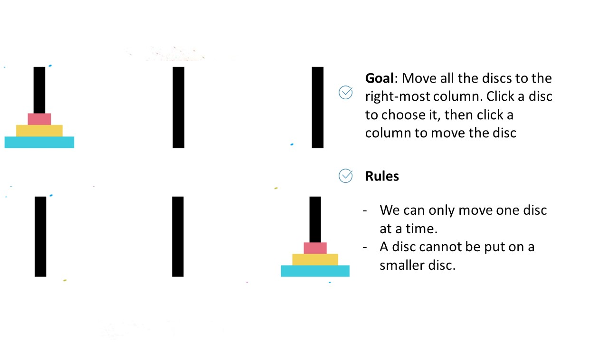

# tower-of-hanoi
A joint project between kienle1609 and vbguyen165 to produce a recreation of the game Tower of Hanoi using Pygame.
 
Disclaimer: This program only works in Python 2.7 and below.
 
In this project, we will be using the Pygame module to recreate The Tower of Hanoi in Python. This game consists of a stack of discs and three columns. The discs start on the first column and the goal is to move them one by one to the third column while preserving the initial order (from smallest to largest). 
 
First, we create a class named disc. Then, we initialize instances of the class disc. Using Pygame, we display the discs and the columns on the screen. In order to move the discs, we instruct the program to accept mouse input from the user. If the user’s input does not satisfy the condition (smaller discs must be on top of the bigger ones), the disc will remain in its position. When all the discs have been moved to the third column, the game ends with a congratulation message to the user. 
 
Some features in the game are users’ choice of the stack’s height (the number of discs) and a start menu.  An example of the game is shown below.
 
 

 
 

 
If any of the images here violate any copyright, contact either of us and we will remove them.
